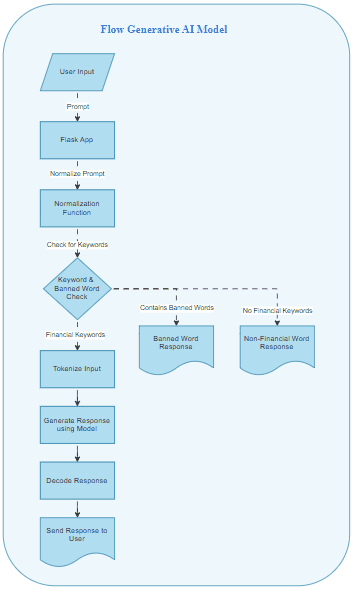
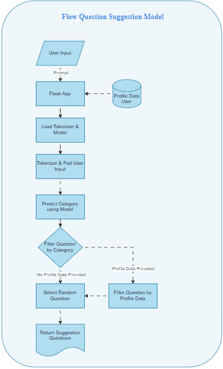

<h1 align="center">Finboost Machine Learning</h1>

<div align="center">

&nbsp;
&nbsp;
&nbsp;
&nbsp;
&nbsp;
&nbsp;
&nbsp;
&nbsp;

</div>

<p align="center">Finboost Machine Learning is a financial chatbot project that can answer finance-related questions in Indonesian. The project leverages deep learning models with fine-tuning on the `cahya/gpt2-small-indonesian-522M` model for generative AI and uses an LSTM model for question suggestion.</p>

---

## Table of Contents

- [Tech Stack](#tech-stack)
- [Architecture](#architecture)
- [File and Folder Structure](#file-and-folder-structure)
- [Flow Diagrams](#flow-diagrams)
- [Setup](#setup)
- [Usage](#usage)
- [Contributing](#contributing)

## Tech Stack

- **Python**: Primary programming language used for the project.
- **Flask**: Web framework for building the REST API.
- **TensorFlow**: Deep learning framework used for model training and inference.
- **Pandas**: Library for data manipulation and analysis.
- **Transformers**: Hugging Face library for working with transformer models.
- **NumPy**: Library for numerical operations.
- **Matplotlib**: Library for creating visualizations.
- **Google Colab**: Cloud service for running Jupyter notebooks.
- **GPT-2**: Transformer model fine-tuned for generating responses.
- **LSTM**: Model used for question suggestion based on user input and profile data.

## Architecture

This project uses the following architecture:

1. **Data Preparation**: Preparing question and answer data in CSV format.
2. **Model Fine-Tuning**: Fine-tuning the `cahya/gpt2-small-indonesian-522M` model using the dataset for generative AI.
3. **LSTM Model**: Using an LSTM model for question suggestion.

## File and Folder Structure

| File/Folder Name                              | Description                                                            |
| --------------------------------------------- | ---------------------------------------------------------------------- |
| `data/generative-ai/finansial-dataset-v2.csv` | Example dataset generative-ai in CSV format                            |
| `data/question-suggestion/data.csv`           | Example dataset question suggestion in CSV format                      |
| `models/fine_tuned_model`                     | Directory to store the fine-tuned generative AI model                  |
| `notebooks/generative_ai.ipynb`               | Notebook for fine-tuning and using the generative AI model             |
| `notebooks/question_suggestion.ipynb`         | Notebook for training and using the LSTM model for question suggestion |
| `preprocessing/combined_dataset.ipynb`        | notebook for preprocessing the collected dataset                       |
| `scripts/`                                    | Folder to save the script in the next feature                          |
| `generative-ai/`                              | Folder to deploy generative-ai model                                   |
| `generative-ai-v2/`                           | Folder to deploy generative-ai-v2 (`Coming soon`)                      |
| `generative-ai-v3/`                           | Folder to deploy generative-ai-v3 (`Coming soon`)                      |
| `question-suggestion/`                        | Folder to deploy question-suggestion model                             |
| `requirements.txt`                            | List of dependencies for this project                                  |

## Flow Diagrams

### Flow Generative AI Model



### Flow Question Suggestion Model



## Setup

1. **Clone the repository:**

   ```bash
   git clone https://github.com/username/finboost-ml.git
   cd finboost-ml
   ```

2. **Create a virtual environment:**
   ```bash
   python -m venv venv
   source venv/bin/activate  # On Windows use `venv\Scripts\activate`
   ```
3. **Install dependencies:**
   ```bash
   pip install -r requirements.txt
   ```
4. **Download and place the datasets:**

   - Place `finansial-dataset-v2.csv` in the `data/generative-ai/` directory.
   - Place `data.csv` in the `data/question-suggestion/` directory.

5. **Create Folder Models:**

- Create a `models` folder in the root directory `/`:
  ```bash
  mkdir models
  ```
  > **NOTE**: When running the Flask application, you must also create model folders within the `generative-ai` and `question-suggestion`
- Create `models` folders in the `generative-ai/models` and `question-suggestion/models` directories:
  ```bash
  mkdir -p generative-ai/models
  mkdir -p question-suggestion/models
  ```

6. **Download and place the models:**
   - Place the fine-tuned generative AI model in the each `models/gen-ai/` directory.
   - Place the question suggestion model files (`tokenizer.pickle`, `label_dict.pickle`, and `model_question_suggestion.h5`) in the each `models/question-suggestion/` directory.
7. **Run the Flask application:**

   ```bash
   python generative-ai/app/main.py
   python question-suggestion/app/main.py
   ```

8. **Download and place the datasets:**
   - Open `notebooks/generative_ai.ipynb` and `notebooks/question_suggestion.ipynb` in Google Colab or Jupyter Notebook and execute the cells.

## Usage

Run the notebook:

1. Run the Generative AI notebook:

- Execute all cells in the `generative_ai.ipynb` notebook to fine-tune the `cahya/gpt2-small-indonesian-522M`model and generate responses.

2. Run the Question Suggestion notebook:

- Execute all cells in the `question_suggestion.ipynb` notebook to train the LSTM model and make question suggestions.

3. Fine-Tuning:

- Use the fine-tuning script `generative_ai.py` to fine-tune the `cahya/gpt2-small-indonesian-522M` model on new data.

4. Question Suggestion:

- Use the `question_suggestion.py` script to train and use the LSTM model for question suggestion.

## Contributing

1. Fork the repository
2. Create a new branch (`git checkout -b feature-branch`)
3. Commit your changes (`git commit -am 'Add new feature'`)
4. Push to the branch (`git push origin feature-branch`)
5. Create a new Pull Request

---

You can save the above content into the `README.md` file for your project. This file includes all the essential information about the project, including folder structure, setup steps, and usage instructions.
